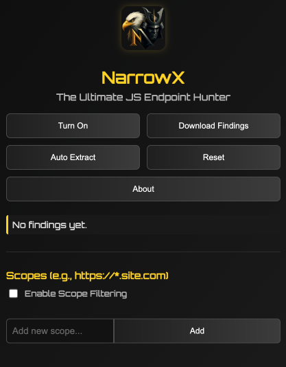
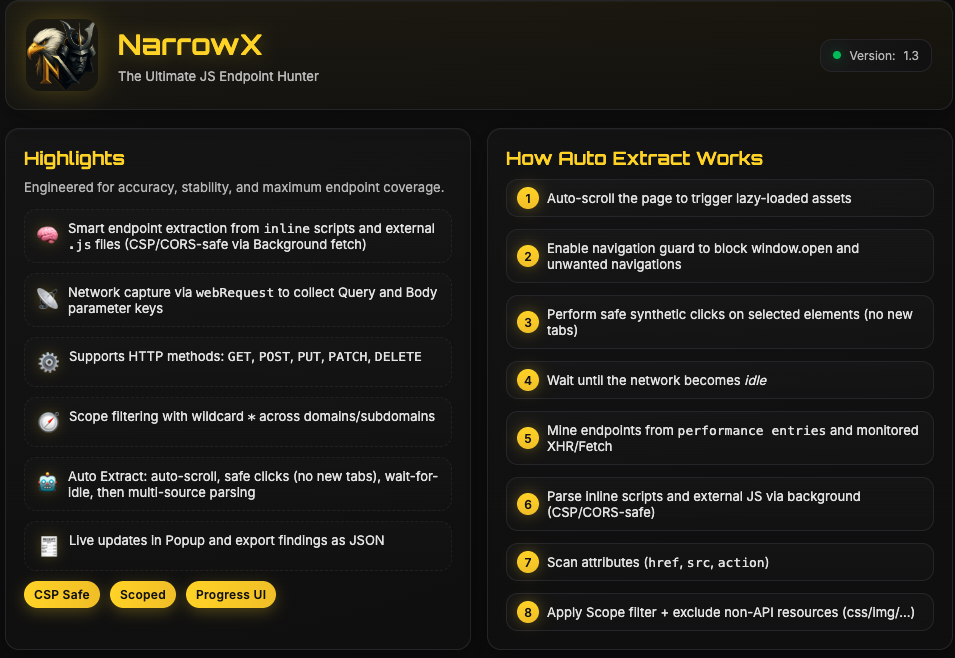

  

<h1 align="center">NarrowX — The Ultimate JS Endpoint Hunter</h1>

  Extract endpoints, parameters, and sensitive indicators from JavaScript and network activity. 
  Built for ‌Bug Bounty Hunters and Security engineers.

---

## Highlights
- Inline and external JS parsing (CSP/CORS-safe via Background fetch)
- Capture network requests & extract parameters
- Auto Extract: auto-scroll + safe synthetic clicks + wait-for-idle + multi-source parsing
- Scope filtering with wildcard `*` across domains/subdomains
- Local-only processing (privacy by design)

## Table of Contents
- [Installation](#installation)
- [Usage](#usage)
- [Features](#features)

## Installation
1. Download/clone this repository.
2. Open Chrome → `chrome://extensions/`
3. Enable “Developer mode”.
4. Click “Load unpacked” and select the repository folder.

## Usage
1. Click the extension icon to open the Popup.
2. Turn it On (Toggle).
3. Optionally set Scopes (e.g., `https://*.target.com`) and enable Scope filtering.
4. Click “Auto Extract” → watch the progress bar.
5. View categorized findings or Download as JSON.

Tips:
- Use Scope to focus on your target and reduce noise.
- Auto Extract performs safe interactions and won’t open new tabs.

## Screenshots

  
  &nbsp;
  

## Features

- **Endpoint discovery** from:
  - Inline scripts
  - External JS files (fetched in background to bypass CSP/CORS)
  - Performance entries (resource requests)
  - XHR/Fetch monitors
  - HTML attributes (href, src, action)
  - Full page HTML sweep

- **Parameter keys extraction** from:
  - Query strings
  - JSON request bodies
  - application/x-www-form-urlencoded request bodies (first-level keys)

- **Progress UI** with stage-by-stage updates
- **Data control**: Reset findings or download as JSON
